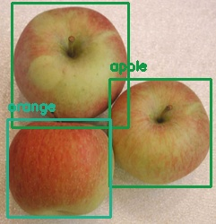

# Obeject detection usin YoloV3 and deployment uisng fast api and docker over AWS EC2 instance

-Created an object detection model using yoloV3
-Used FastApi for deployment of the model
-When talking about deploying, what is usually meant is to put all of the software required for predicting in a server. By doing this, a client can interact with the model by sending requests to the server.
-The API was coded using fastAPI but the serving was done using uvicorn, which is a really fast Asynchronous Server Gateway Interface (ASGI) implementation.  
-With fastAPI you can create web servers to host your models very easily. Additionally, this platform is extremely fast and it has a built-in client that can be used to interact with the server. 

##Deployemnt over AWS EC2 instance using Docker to contanerize the app

-Create an AWS EC2 intance
-Intall Docker on it
-Create a Repository in AWS ECR
-Create an IAM role with ContainerRegistryFullAccess
-Assign the role to EC2 instance
-Download pythonApp from Github.
-Build docker image for the Python App
-Push docker image to ECR
7. Run python app in Docker container

